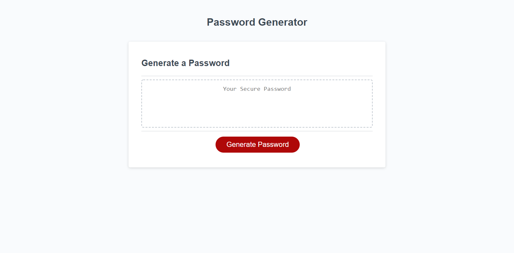

# Password Generator Mini Project

## Description

In this project we start out by cloning the starter code, and creating a password generator that meets the Acceptance Criteria. This module's Challenge requires you to create an application that an employee can use to generate a random password based on criteria they've selected. This app will run in the browser, and will feature dynamically updated HTML and CSS powered by JavaScript code that you write. It will have a clean and polished user interface that is responsive, ensuring that it adapts to multiple screen sizes. 

## Resources
[Git Hub Password Generator]()

[LIVE SITE]()

## Table of Contents 

- [Usage](#usage)
- [Visuals](#visuals)

## Usage
I was able to add semantic values to the tags within the HTML file, but I also wanted to make sure that the site still functioned properly.  
Provided notes within each element to explain the changes made throughout the assignment. 

## Visuals

